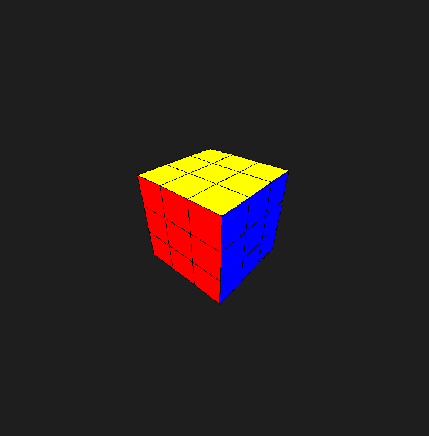

# Rubik's Cube Auto Solver



## About

A 3D rendered rubik's cube with auto solving capabilities. This project was built for my A Level Non Exam Assessment. You can rotate the cube with WASD, spin the sides with 123456789IOPJKLBNM and solve the cube with X.

## Installation & Setup

Follow these steps to set up and run the project:

1. **Clone the repository:**
   ```sh
   git clone https://github.com/Aleks-Tacconi/ALevelNEA.git
   ```
2. **Navigate to the project directory:**
   ```sh
   cd ALevelNEA
   ```
3. **Install dependencies:**
   ```sh
   make install
   ```
4. **Run the project:**
   ```sh
   make run
   ```
